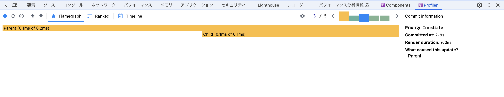
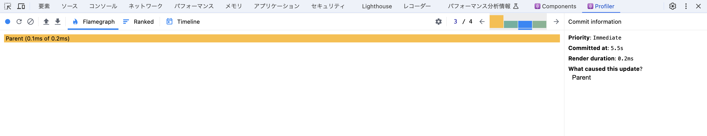
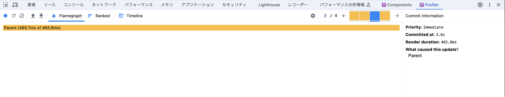
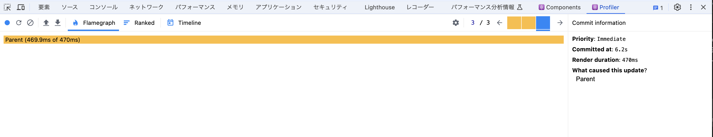
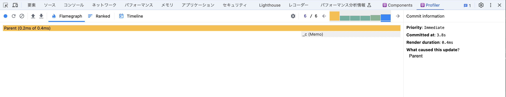
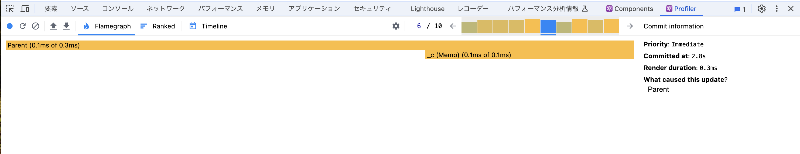
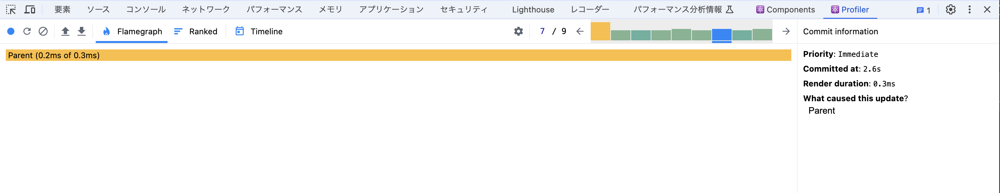

## はじめに

Reactを勉強し初めの頃、hooksの中でもuseMemoやuseCallbackが中々理解できませんでした。
レンダリングやコンポーネントの考え方の理解が必要な点が難しいのかなと思います。（そこがReactの特徴なので当然かもしれませんが）

自分の理解を深めるためにも、「React.memo」「useMemo」「useCallback」についてまとめてみようと思います。

## どういった場面で使うのか

「React.memo」「useMemo」「useCallback」は、3つとも**パフォーマンスを向上させる目的で使用**します。

今回は、視覚的にパフォーマンスを確認するために「React Developer Tools」というchromeの拡張機能を使用します。
[こちらから](https://chromewebstore.google.com/detail/react-developer-tools/fmkadmapgofadopljbjfkapdkoienihi?hl=ja)ダウンロードできます。

## レンダリングされるタイミング

まず前提知識として、Reactアプリにおいてレンダリングが走る主なタイミングは以下の3つです。

**１. コンポーネントが初めてレンダリングされるとき**
**２. 状態（state）やプロパティ（props）が変更されたとき**
**３. 親コンポーネントがレンダリングされた時**

２と３では、再レンダリングの必要が無い（変更が無い）コンポーネントまで再レンダリングされることが考えられます。
このような**無駄なレンダリングを回避してパフォーマンスを向上させる**のが「React.memo」「useMemo」「useCallback」たちです。

## React.memo

次のようなカウンターのコードを考えます。


```jsx
import { useState } from 'react';
import './App.css';

const Child = () => {
  return <p>子コンポーネント</p>
}

export default function Parent() {
  const [count, setCount] = useState(0);

  const handleIncrement = () => {
    setCount(count + 1);
  }

  const handleDecrement = () => {
    setCount(count - 1);
  }

  return (
    <div>
      <p>親コンポーネント</p>
      <div className='counter'>
        <button onClick={handleIncrement}>+</button>
        <p>{count}</p>
        <button onClick={handleDecrement}>-</button>
      </div>
      <Child />
    </div>
  )
}
```

まだReact.memoなどは使っていません。

このコードでは、`count`という状態(state)を親コンポーネントであるParentが管理しています。
よって、カウンターのボタンを押すと`count`を変更され、Parentが再レンダリングされます。
（「レンダリングされるタイミング」の２）
すると、親コンポーネントがレンダリングされると子コンポーネントもレンダリングされるので、Childも再レンダリングされます。
（「レンダリングされるタイミング」の3）

React Dev Toolsでも確認してみます。



Parentと一緒にChildもレンダリングされてしまっています。

しかし、今回はParentに変更があったところでChildは全く変化しないので、このレンダリングは不要なレンダリングです。
では、次のようにコードを修正してみます。

```jsx
import { useState } from 'react';
import './App.css';

const Child = React.memo() => {
  return <p>子コンポーネント</p>
}

export default function Parent() {
  const [count, setCount] = useState(0);

  const handleIncrement = () => {
    setCount(count + 1);
  }

  const handleDecrement = () => {
    setCount(count - 1);
  }

  return (
    <div>
      <p>親コンポーネント</p>
      <div className='counter'>
        <button onClick={handleIncrement}>+</button>
        <p>{count}</p>
        <button onClick={handleDecrement}>-</button>
      </div>
      <Child />
    </div>
  )
}
```

ChildをReact.memoで括り、メモ化しました。
これでカウンターをクリックしてみて、どう変わるのか見てみます。



**Parentがレンダリングされているにもかかわらず、Childがレンダリングされていません。**

これがReact.memoの効果で、React.memoでメモ化したコンポーネントはそのコンポーネントの中身に変化がない限りレンダリングされなくなります。
こうすることで、子コンポーネントの無駄な再レンダリングを回避することができます。

> **React.memoはコンポーネントをメモ化する**

## useMemo

今度はこのアプリに、テキスト入力フォームを設置し、countを2倍したdoubleCountという値を表示してみます。

```jsx
import React, { useState } from 'react';
import './App.css';

const Child = React.memo(() => {
  return <p>子コンポーネント</p>
})

export default function Parent() {
  const [count, setCount] = useState(0);
  const [text, setText] = useState("");

  const handleIncrement = () => {
    setCount(count + 1);
  }

  const handleDecrement = () => {
    setCount(count - 1);
  }

  const heavyProcess = (count: number) => {
    let i = 0;
    while (i < 1000000000) i++; // 時間のかかる重い処理

    return count * 2;
  }

  const doubleCount = heavyProcess(count);

  const handleChangeText = (e: React.ChangeEvent<HTMLInputElement>) => {
    setText(e.target.value);
  }

  return (
    <div>
      <p>親コンポーネント</p>
      <input
        type='text'
        onChange={handleChangeText}
        value={text}
      />
      <div className='counter'>
        <button onClick={handleIncrement}>+</button>
        <p>count:{count} / doubleCount:{doubleCount}</p>
        <button onClick={handleDecrement}>-</button>
      </div>
      <Child />
    </div>
  )
}
```


テキストを入力して`text`が変化するたびにParentが再レンダリングされるので、その度に`heavyProcess関数`も実行されます。
この`heavyProcess関数`の中に`while (i < 1000000000) i++;`という重い処理が含まれています。

テキストに文字を入力してReact Dev Toolsで確認してみます。



右側の欄の`Render duration:465.8ms`という部分が、テキスト入力によるレンダリングでかかった時間を表しています。
かなりの時間がかかっていて、実際に入力して文字が反映されるまでもかなりの遅れを感じます。
こうなってしまうとユーザーのストレスが溜まりUXの低下につながるため、パフォーマンスの改善が必要です。

今回の問題点は、カウンターをクリックした時だけでなくテキストを入力したときにもtextが変化することで再レンダリングが走り、`heavyProcess関数`を実行してしまっていることです。
カウンターをクリックしたときは、`count`が変わりそれに伴って`doubleCount`も変わる必要があるので、`heavyProcess関数`の実行は必要です。
しかし、テキストを入力したときは`count`に変化がないので、`heavyProcess関数`の実行は必要ありません。

要するに、`count`に変更があったときのみ`heavyProcess関数`が実行されれば良いわけです。

ここで、次のようにコードを修正してみます。

```jsx
import React, { useMemo, useState } from 'react';
import './App.css';

const Child = React.memo(() => {
  return <p>子コンポーネント</p>
})

export default function Parent() {
  const [count, setCount] = useState(0);
  const [text, setText] = useState("");

  const handleIncrement = () => {
    setCount(count + 1);
  }

  const handleDecrement = () => {
    setCount(count - 1);
  }

  const heavyProcess = (count: number) => {
    let i = 0;
    while (i < 1000000000) i++; // 時間のかかる重い処理

    return count * 2;
  }

  const doubleCount = useMemo(() => {
    return heavyProcess(count);
  }, [count]);

  const handleChangeText = (e: React.ChangeEvent<HTMLInputElement>) => {
    setText(e.target.value);
  }

  return (
    <div>
      <p>親コンポーネント</p>
      <input
        type='text'
        onChange={handleChangeText}
        value={text}
      />
      <div className='counter'>
        <button onClick={handleIncrement}>+</button>
        <p>count:{count} / doubleCount:{doubleCount}</p>
        <button onClick={handleDecrement}>-</button>
      </div>
      <Child />
    </div>
  )
}

```

問題だった`heavyProcess関数`が呼び出される部分を**useMemo**で括りました。
また、useMemoは第二引数に依存配列を取り、ここに指定した変数が変更されたときのみ中の関数を実行します。（useEffectと似てる）

まずはカウンターをクリックしたときのパフォーマンスをみてみます。



依存配列に指定した変数`count`が変わるので、`heavyProcess関数`が今まで通り実行されています。

次にテキストを入力したときのパフォーマンスを見てみます。



今度は`count`に変更がないので`heavyProcess関数`が実行されず、スムーズに動いています。

これがuseMemoの効果で、useMemoでメモ化した関数は依存配列に指定した変数に変化がない限り実行されなくなります。
こうすることで、無駄な関数の実行を回避することができます。
（`heavyProcess関数`の実行をスキップし、キャッシュしたデータ（doubleCount）を使用する）

> **useMemoは関数をメモ化する**

## useCallback

今度はParentからChildに`handleClick`というpropsを渡して、Childの方にボタンを設置してみます。

```jsx
import React, { useMemo, useState } from 'react';
import './App.css';

const Child = React.memo((props: { handleClick: () => void }) => {
  return (
    <div>
      <p>子コンポーネント</p>
      <button onClick={props.handleClick}>子コンポーネントのボタン</button>
    </div>
  )
})

export default function Parent() {
  const [count, setCount] = useState(0);
  const [text, setText] = useState("");

  const handleClick = () => {
    console.log("子コンポーネントでボタンがクリックされました。")
  }

  const handleIncrement = () => {
    setCount(count + 1);
  }

  const handleDecrement = () => {
    setCount(count - 1);
  }

  const heavyProcess = (count: number) => {
    let i = 0;
    while (i < 1000000000) i++; // 時間のかかる重い処理

    return count * 2;
  }

  const doubleCount = useMemo(() => {
    return heavyProcess(count);
  }, [count]);

  const handleChangeText = (e: React.ChangeEvent<HTMLInputElement>) => {
    setText(e.target.value);
  }

  return (
    <div>
      <p>親コンポーネント</p>
      <input
        type='text'
        onChange={handleChangeText}
        value={text}
      />
      <div className='counter'>
        <button onClick={handleIncrement}>+</button>
        <p>count:{count} / doubleCount:{doubleCount}</p>
        <button onClick={handleDecrement}>-</button>
      </div>
      <Child handleClick={handleClick}/>
    </div>
  )
}
```


UIがメチャクチャですが許してください（笑）

ParentがレンダリングされてもChildはメモ化しているからレンダリングされなさそうですが、今回はChildにpropsを渡しています。
React.memoの効果は「**そのコンポーネントの中身に変化がない限り**レンダリングされなくなる」でした。
渡されたpropsを通じて変化が生じているため、Childもレンダリングされてしまいます。

例えば、テキストを入力したら`text`に変更があるのでParentがレンダリングされ、propsを通じてChildもレンダリングされてしまいます。
React Dev Toolsで確認してみます。



`Parent`の下に`_c(Memo)`というメモ化したはずのChildがレンダリングされてしまっています。

これは、Parentがレンダリングされたときに`handleClick関数`が生成されてしまっているのが原因です。
`handleClick関数`は、Childのボタンがクリックされた時のみ生成されれば良いのです。

何となく「`handleClick関数`をメモ化すればいいんじゃないか」と予想できたかと思いますが、その通りです。
次のようにコードを修正してみます。

```jsx
import React, { useCallback, useMemo, useState } from 'react';
import './App.css';

const Child = React.memo((props: { handleClick: () => void }) => {
  return (
    <div>
      <p>子コンポーネント</p>
      <button onClick={props.handleClick}>子コンポーネントのボタン</button>
    </div>
  )
})

export default function Parent() {
  const [count, setCount] = useState(0);
  const [text, setText] = useState("");

  const handleClick = useCallback(() => {
    console.log("子コンポーネントでボタンがクリックされました。")
  }, [])

  const handleIncrement = () => {
    setCount(count + 1);
  }

  const handleDecrement = () => {
    setCount(count - 1);
  }

  const heavyProcess = (count: number) => {
    let i = 0;
    while (i < 1000000000) i++; // 時間のかかる重い処理

    return count * 2;
  }

  const doubleCount = useMemo(() => {
    return heavyProcess(count);
  }, [count]);

  const handleChangeText = (e: React.ChangeEvent<HTMLInputElement>) => {
    setText(e.target.value);
  }

  return (
    <div>
      <p>親コンポーネント</p>
      <input
        type='text'
        onChange={handleChangeText}
        value={text}
      />
      <div className='counter'>
        <button onClick={handleIncrement}>+</button>
        <p>count:{count} / doubleCount:{doubleCount}</p>
        <button onClick={handleDecrement}>-</button>
      </div>
      <Child handleClick={handleClick}/>
    </div>
  )
}
```

問題だった`handleClick関数`を**useCallback**で括りました。
また、useCallbackも第二引数に依存配列を取り、ここに指定した変数が変更されたときのみ中の関数が生成されます。
今回は空配列を指定したので、マウント時にだけ生成されます。

では、テキストを変更したときの挙動をReact Dev Toolsで確認してみます。



Parentがレンダリングされているものの、Childはレンダリングされなくなりました。
これは、`handleClick関数`をメモ化し他ので、Parentがレンダリングされても`handleClick関数`が生成されずChildに変化がないためです。

useCallbackはコールバック関数をメモ化し、useCallbackでメモ化したコールバック関数は依存配列に指定した変数に変化がない限り再生成されなくなります。

> コールバック関数：他の関数に引数として渡される関数

こうすることで、propsを渡す子コンポーネントの不要なレンダリングを回避することができます。

> **useCallbackはコールバック関数をメモ化する**

## まとめ

**React.memo・・・コンポーネントをメモ化**
**useMemo・・・関数をメモ化**
**useCallback・・・コールバック関数をメモ化**

## 最後に

今回取り上げた「React.memo」「useMemo」「useCallback」は、あくまで**重い処理が無駄に実行されてしまっている時に効果のあるもの**です。
パフォーマンス的に何の問題もないのに何でもかんでもメモ化すると、**かえってそれがオーバーヘッドになりかねないので注意が必要**です。

## 余談

ちなみに今回、初めてcreate-react-app(webpack)ではなく**vite**でreactの環境構築をしてみましが、めちゃくちゃ早くて設定も簡単で驚きました。
ただ、webpackと比べるとエコシステムが充実していないなどのデメリットもあるようなので、状況に応じて選択する必要がありそうです。